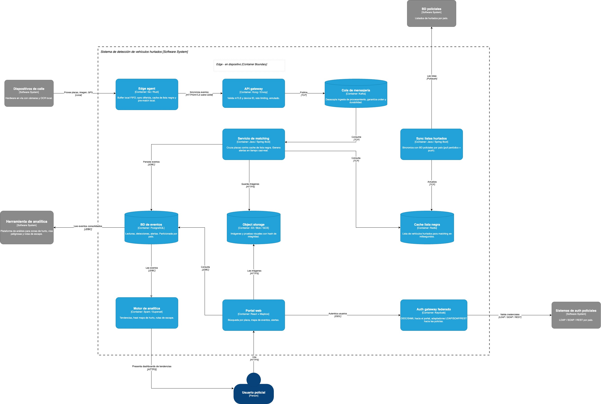

# Propuesta de Arquitectura de Solución
## Sistema para combatir el hurto de vehículos

---

## 📄 1. Resumen de la Propuesta

Ceiba requiere una plataforma que apoye a las entidades policiales de múltiples países a combatir el hurto de vehículos, identificando tendencias y facilitando la recuperación de unidades robadas. La solución debe operar sobre dispositivos de calle con severas restricciones de hardware (2 cores, 1 GB RAM, 16 GB de disco), conectividad GSM intermitente y energía inestable que puede fallar hasta cuatro horas con apenas una hora de batería de respaldo, integrarse con bases de datos policiales heterogéneas por país y con sistemas de autenticación dispares (LDAP, BD propia, SOAP, REST), correr sobre cualquier nube pública o privada, escalar dinámicamente desde Latinoamérica hasta el mundo, garantizar alta disponibilidad y proteger la comunicación contra dispositivos o personas no autorizados.

La solución propuesta se resuelve con una arquitectura distribuida que reparte inteligencia entre el dispositivo y la nube. El borde captura, persiste localmente, pre-valida contra la lista de hurtados y sincroniza de forma diferida tolerando fallas de red y energía. El núcleo en la nube ejecuta el matching central, almacena las imágenes, genera las alertas operativas, sirve la búsqueda por matrícula con visualización en mapa y alimenta la analítica de tendencias. El despliegue es containerizado sobre Kubernetes con una capa de abstracción que evita el acoplamiento al proveedor cloud, replicado por país para garantizar la soberanía de datos exigida por la operación multi-país, y gestionado de forma centralizada vía GitOps sin que datos operativos crucen fronteras.

---

## 🏗️ 2. Arquitectura de la Solución

La arquitectura se documenta en cinco diagramas. Los dos primeros siguen la notación C4 y describen el sistema en sus dos primeros niveles (contexto y contenedores). Los tres siguientes son diagramas técnicos complementarios que profundizan en el comportamiento dinámico ante fallas, la topología de despliegue y la integración federada de identidad.

### 2.1. Diagrama de contexto del sistema

Este diagrama muestra el sistema como una plataforma de detección que conecta tres realidades operativas distintas: los dispositivos en las calles que ven los vehículos pasar, las bases de datos de las policías que saben cuáles fueron hurtados, y los investigadores que necesitan esa información para actuar.

El flujo central es el siguiente: los dispositivos de calle capturan cada vehículo que transita, extraen la matrícula mediante OCR local y envían esa lectura al sistema. El sistema la cruza contra los listados de vehículos hurtados que cada policía nacional mantiene en su propia base de datos. Cuando hay coincidencia, alerta al usuario policial con la fecha, el lugar y la prueba visual de dónde fue visto ese vehículo. Cuando no hay coincidencia, el evento queda registrado y disponible para que un investigador pueda buscar cualquier matrícula en el futuro y reconstruir su historial de apariciones en el mapa.

Más allá del flujo de datos, el diagrama establece dos integraciones que tienen impacto directo en el diseño interno. La primera es con los sistemas de autenticación de cada institución policial: como las policías de distintos países usan tecnologías diferentes (LDAP, bases de datos propias, servicios SOAP, servicios REST), el sistema no puede asumir un solo protocolo de login y debe adaptarse a cada uno sin imponer cambios en las instituciones. La segunda es con la herramienta de analítica: los datos recolectados desde los dispositivos no sirven solo para alertas individuales, sino que consolidados permiten identificar zonas donde más vehículos hurtados transitan, vías recurrentes de escape y patrones temporales de hurto, información que apoya la inteligencia policial estratégica más allá de la interceptación operativa inmediata.

### 2.2. Diagrama de contenedores

El diagrama de contenedores abre el sistema y muestra cómo se resuelve internamente cada una de las capacidades que el contexto establece.

La captura desde los dispositivos la maneja el Edge Agent, que corre directamente dentro del hardware de cada cámara de calle. No es un componente pasivo: persiste cada lectura localmente en disco antes de intentar enviarla, ejecuta un primer cruce contra una copia local de la lista de hurtados para identificar coincidencias sin depender de la red, y sincroniza con la nube cuando la conexión GSM está disponible. Esta inteligencia en el borde es lo que garantiza que ninguna placa se pierda aunque el dispositivo quede sin red o sin energía por horas.

Una vez los eventos llegan a la nube, el API Gateway los recibe validando que el dispositivo que los envía esté autorizado, y los deposita en una cola de mensajería que desacopla la velocidad de llegada de la velocidad de procesamiento. Esto es crítico porque cuando decenas de dispositivos recuperan conectividad simultáneamente tras una caída de red, el sistema absorbe el pico sin caer. Desde la cola, el Servicio de Matching cruza cada placa contra la lista de hurtados mantenida en cache en memoria, y cuando encuentra una coincidencia genera la alerta y almacena la detección con su prueba visual.

La lista de hurtados que el Servicio de Matching consulta no es estática: el Servicio de Sincronización de Listas la mantiene fresca, jalando periódicamente los registros de las bases de datos policiales de cada país y actualizando la cache. Cuando una policía reporta un hurto reciente, el sistema también soporta un push urgente para que ese vehículo sea detectable de inmediato sin esperar al próximo ciclo de sincronización.

El almacenamiento está dividido en tres stores con propósitos distintos. La base de datos de eventos guarda el historial completo de lecturas, detecciones y alertas, particionado por país y tiempo, y es la fuente que responde la búsqueda por matrícula con toda la trazabilidad del vehículo en el mapa. El object storage guarda las imágenes con hash de integridad, que son la prueba visual que acompaña cada evento. La cache en Redis mantiene la lista negra en memoria para que el matching sea en milisegundos.

La capa de presentación tiene dos componentes con propósitos distintos. El Portal Web sirve la operación diaria del investigador policial: buscar una matrícula, ver en el mapa dónde y cuándo fue visto ese vehículo, ver la foto capturada y recibir alertas activas. El Motor de Analítica sirve la inteligencia estratégica: heat maps de zonas con más hurtos, vías de escape recurrentes y patrones temporales, consolidando la información de todos los dispositivos de todos los países.

Finalmente, el Auth Gateway federado resuelve que cada policía tiene su propio sistema de login. Actúa como intermediario: recibe la solicitud de acceso del usuario, detecta el país, traduce al protocolo que esa policía usa (LDAP, SOAP o REST) y devuelve un token estándar que el portal y los demás servicios reconocen. Para el usuario policial el login es transparente; para el sistema, agregar un nuevo país es simplemente registrar un adaptador nuevo sin tocar ningún otro componente.

### 2.3. Diagrama de secuencia: flujo del dato

Se documenta el recorrido completo de una lectura de placa desde el momento en que la cámara captura un vehículo hasta que el sistema genera una alerta o registra el evento para análisis posterior. Lo hace en tres escenarios operativos distintos, porque el sistema debe comportarse correctamente no solo cuando todo funciona, sino también cuando falla la red o se va la energía.

En condiciones normales, el dispositivo captura la imagen, el OCR extrae la matrícula con un score de confianza, y el Edge Agent empaqueta el evento con la placa, la imagen, las coordenadas GPS y el timestamp. Antes de intentar cualquier envío, persiste el evento en el buffer local en disco: este es el paso que garantiza que nada se pierda independientemente de lo que ocurra después. Luego ejecuta un primer cruce local contra la copia cacheada de la lista de hurtados para marcar el evento como prioritario si hay coincidencia, y sincroniza con la nube vía HTTPS con mTLS. El API Gateway valida que el dispositivo esté autorizado y deposita el evento en la cola. Desde ahí el Servicio de Matching cruza la placa contra la lista en memoria: si hay match, genera la alerta al usuario policial y persiste la detección con la prueba visual; si no, registra el evento para el historial. Solo cuando el sistema confirma la recepción con un ACK, el Edge Agent purga esos eventos del buffer local.

Cuando no hay cobertura GSM, el dispositivo no se detiene: sigue capturando placas y acumulándolas en disco. El buffer tiene capacidad para absorber varias horas de capturas sin desbordamiento. Mientras tanto reintenta la conexión con intervalos crecientes para no agotar la batería en esperas infructuosas. Cuando la señal regresa, sincroniza en bloque priorizando primero los eventos marcados como match local, para que las alertas más relevantes lleguen al sistema central antes que el flujo regular.

El escenario más exigente es el corte de energía. La batería da aproximadamente una hora de operación, durante la cual el dispositivo funciona con normalidad. Cuando la carga baja del quince por ciento, ejecuta un cierre ordenado: vuelca el buffer completo al disco y hace un último intento de sincronización antes de apagarse. Cuando la energía regresa, el dispositivo arranca, compara lo que tiene en disco contra el último ACK confirmado por el sistema y sincroniza únicamente el delta pendiente, evitando duplicados y asegurando que no se pierda ninguna lectura del período sin energía.

El invariante que atraviesa los tres escenarios es siempre el mismo: el evento se persiste en disco antes de cualquier intento de envío, y solo se elimina del buffer cuando el sistema confirma que lo recibió. Eso es lo que hace posible garantizar que ninguna placa captada se pierde, sin importar cuánto tiempo dure el corte ni cuántas veces falle el reintento.

### 2.4. Diagrama de despliegue

El diagrama de despliegue muestra dónde corre físicamente cada componente del sistema y cómo se organiza la infraestructura para cumplir con tres exigencias que tienen tensión entre sí: operar en múltiples países respetando que los datos no salgan de cada territorio, poder cambiar de proveedor cloud sin reescribir el sistema, y crecer desde un piloto en Latinoamérica hasta una operación global sin cambiar la arquitectura.

La respuesta a la portabilidad cloud está en dos capas. La primera es Kubernetes como sustrato de ejecución: todos los servicios corren containerizados y Kubernetes es el denominador común entre AWS, Azure, GCP y clusters auto-gestionados en nube privada. La segunda es una capa de abstracción que media el acceso a los servicios de plataforma como el almacenamiento de objetos, la base de datos, la cache y el balanceo de carga. Los servicios de la aplicación nunca hablan directamente con S3, Azure Blob o GCS: hablan con una interfaz portable, y lo que hay detrás es reemplazable por país o por decisión de negocio sin tocar una línea de código. Cambiar de proveedor es un problema de configuración, no de desarrollo.

La respuesta a la soberanía de datos es una región independiente por país. Cada región tiene su propio cluster Kubernetes y sus propios servicios de almacenamiento, lo que significa que los datos operativos de Colombia nunca llegan a los servidores de México y viceversa. Esta separación también resuelve el crecimiento global: agregar un nuevo país es desplegar una nueva región con la misma imagen de contenedores, solo ajustando los valores de configuración específicos del país mediante Helm values. No hay modificaciones de código, no hay coordinación de equipos, no hay riesgo de afectar a las regiones existentes.

El escalado dentro de cada región lo maneja el HPA de Kubernetes con métricas específicas por componente. El API Gateway escala por carga de ingesta, el servicio de matching escala por la profundidad de la cola Kafka, y el portal escala por requests por segundo. Cuando decenas de dispositivos recuperan conectividad simultáneamente tras una caída de red y empiezan a sincronizar en bloque, el sistema absorbe el pico sin intervención manual y sin perder eventos.

El plano de gestión centralizado vive fuera de todas las regiones y es el único componente verdaderamente global. Su función es operar el sistema desde un solo lugar: despliega a todas las regiones vía GitOps con ArgoCD, distribuye las imágenes Docker desde un registry central, gestiona los secrets y Helm values por país desde un Vault único, y actualiza remotamente los dispositivos de calle con nuevas versiones de la lista negra o del firmware mediante distribución OTA. Lo que nunca hace es almacenar datos operativos, garantizando que la gestión centralizada no entre en conflicto con el aislamiento de datos por país.

Los dispositivos de calle aparecen como un deployment node separado porque tienen su propia computación embebida. El Edge Agent que corre dentro de cada dispositivo es el puente entre el hardware de captura y la infraestructura cloud, y su capacidad de operar de forma autónoma durante horas sin red ni energía es lo que hace posible que el sistema garantice la recolección de datos incluso en las condiciones más adversas del campo.

### 2.5. Diagrama de secuencia: autenticación federada

El diagrama muestra cómo un usuario policial de cualquier país accede al sistema con sus propias credenciales institucionales, sin que el sistema le imponga un mecanismo de login diferente al que ya usa su policía, y sin que esa heterogeneidad afecte a ningún otro componente interno.

El punto de partida es que cada institución policial gestiona su identidad de forma independiente y con tecnologías distintas. Unas tienen Active Directory con LDAP, otras un servicio corporativo sobre SOAP, otras una API REST moderna. Obligar a cada policía a cambiar su sistema de identidad para integrarse con la plataforma no es viable, y construir cada servicio interno del sistema para que hable con todos los protocolos posibles es un problema que crece sin control a medida que se incorporan nuevos países.

La solución es concentrar toda esa complejidad en un único componente, el Identity Broker, que actúa como intermediario entre el mundo externo y el mundo interno. Hacia afuera habla el protocolo de cada policía. Hacia adentro habla siempre OIDC y SAML, que son los estándares que el portal y el resto de servicios conocen.

Cuando un usuario policial accede al portal e indica su país, el portal redirige la autenticación al broker. El broker identifica qué adaptador corresponde a ese país y lo invoca: si la policía usa LDAP, el adaptador ejecuta un bind y search contra Active Directory; si usa SOAP, construye un request con WS-Security; si usa REST, llama al endpoint con OAuth2 o API key. En los tres casos el adaptador devuelve al broker la identidad del usuario con sus atributos, y el broker emite un JWT estándar con los claims normalizados: quién es el usuario, de qué país, qué rol tiene y qué permisos. Ese token es lo único que el portal y los demás servicios internos necesitan para operar. No saben ni les importa si el usuario se autenticó por LDAP, SOAP o REST.

Hay dos consecuencias de este diseño que vale la pena destacar. La primera es que incorporar un nuevo país al sistema no requiere tocar el portal, el matching, la analítica ni ningún otro componente: solo hay que escribir el adaptador del nuevo protocolo y registrarlo en el broker. La segunda es que el broker no se convierte en un cuello de botella a medida que crece el número de usuarios: una vez emitido el JWT, cada servicio lo valida localmente con la clave pública del broker, sin necesidad de consultarlo en cada llamada. El broker solo interviene en el momento del login, no en cada operación que el usuario realiza después.

---

## 🧩 3. Componentes Principales

A continuación se describen los componentes que conforman la solución, agrupados por capa lógica, con énfasis en la responsabilidad concreta de cada uno frente a los requisitos del caso.

**Capa edge.** El Edge Agent corre dentro de cada dispositivo de calle. Recibe del componente OCR del dispositivo la matrícula reconocida con su score de confianza, empaqueta el evento con metadata (placa, imagen capturada, coordenadas GPS, timestamp), lo persiste en un buffer FIFO local, ejecuta un pre-match contra una cache local de la lista negra para marcar la prioridad de sincronización, y sincroniza con la nube cuando hay GSM disponible. Es el componente que materializa la garantía de no-pérdida de datos del enunciado.

**Capa de ingesta.** El API Gateway es el punto único de entrada de los eventos hacia la nube. Valida los certificados mTLS y el identificador del dispositivo para impedir que dispositivos no autorizados envíen información, aplica rate limiting para protegerse de inundaciones, y enruta los eventos hacia la cola de mensajería. Esto implementa directamente el requisito de comunicación segura del enunciado. La Cola Kafka desacopla la velocidad de ingesta de la velocidad de procesamiento, garantiza orden de eventos por dispositivo y aporta durabilidad mediante replicación entre brokers, lo que permite absorber picos de sincronización (típicos cuando muchos dispositivos recuperan red simultáneamente) sin perder eventos.

**Capa de procesamiento.** El Servicio de Matching consume los eventos de la cola, cruza cada placa contra la cache de lista negra y, ante una coincidencia, genera la alerta operativa en tiempo casi-real, persiste la detección con su prueba visual y dispara la notificación al usuario policial. Esta es la función central del sistema. El Servicio de Sincronización de Listas mantiene actualizada la cache de lista negra; ejecuta pull periódico contra las BD policiales de cada país y soporta push urgente cuando una policía reporta un hurto reciente, lo que garantiza que un vehículo robado sea detectable rápidamente sin esperar al siguiente ciclo de sincronización.

**Capa de almacenamiento.** La BD de Eventos sobre PostgreSQL almacena las lecturas, detecciones y alertas, particionada por país y por tiempo, lo que mantiene los tiempos de consulta acotados a medida que el volumen crece. Sirve la búsqueda por matrícula que el enunciado pide como funcionalidad principal. El Object Storage almacena las imágenes y pruebas visuales con hash de integridad, lo que sustenta la trazabilidad de la prueba visual exigida por el enunciado. La Cache de Lista Negra sobre Redis mantiene la lista de vehículos hurtados en memoria para que el matching contra el flujo de eventos sea en milisegundos, permitiendo alertar a tiempo para interceptación operativa.

**Capa de presentación.** El Portal Web ofrece la búsqueda por matrícula con visualización en mapa que el enunciado solicita explícitamente, junto con la presentación de eventos, la prueba visual asociada, las alertas activas y los reportes operativos. El Motor de Analítica sobre Spark y Superset procesa los eventos consolidados y presenta tendencias, heat maps de zonas de hurto, vías peligrosas y rutas de escape recurrentes; cubre el requisito del enunciado de integrar una herramienta de análisis de datos para identificar tendencias.

**Capa transversal.** El Auth Gateway federado, sobre Keycloak, materializa el patrón Identity Broker que aísla a los servicios internos de la heterogeneidad de los sistemas de autenticación policiales. Expone OIDC y SAML hacia adentro y traduce hacia LDAP, SOAP o REST según el adaptador del país.

**Plano de gestión centralizado.** Vive fuera de las regiones operativas y no almacena datos del negocio. Lo componen ArgoCD para despliegue declarativo vía GitOps, un registry central de imágenes Docker, un Vault de configuración con secrets y Helm values por país, un servicio de Device Management para registro de dispositivos, monitoreo de salud y distribución OTA de listas negras y firmware, y un dashboard de operaciones cross-país. Permite operar el sistema globalmente desde un solo plano de control sin que datos operativos crucen fronteras.

---

## 🎯 4. Decisiones de Diseño

**Procesamiento en el borde con sincronización diferida.** El requisito de no-pérdida de datos ante cortes de GSM y energía, dadas las restricciones documentadas en el enunciado (cobertura intermitente, una hora de batería frente a cortes de hasta cuatro horas), hace inviable depender exclusivamente del procesamiento central. La decisión es darle inteligencia local al dispositivo: buffer FIFO persistente como invariante absoluto, pre-match local contra una cache cacheada de la lista negra, retry con backoff exponencial para no agotar batería, y shutdown ordenado con flush final cuando la batería baja del quince por ciento. Como alternativa se evaluó el envío inmediato sin buffer local; se descartó porque garantiza pérdida de datos en los escenarios que el enunciado documenta como recurrentes.

**Cloud-agnóstico mediante Kubernetes y capa de abstracción.** El enunciado pide explícitamente evitar el acoplamiento al proveedor cloud y dejar abierta la opción de nube privada. La decisión es containerizar todos los servicios sobre Kubernetes y mediar el acceso a servicios de plataforma a través de una capa de abstracción con interfaces portables. Cambiar de proveedor implica reemplazar la implementación de la capa, no reescribir servicios. Como alternativa se consideró usar servicios serverless propios de cada proveedor; se descartó porque genera el acoplamiento que el enunciado pide evitar y porque limita la portabilidad hacia nube privada.

**Aislamiento de datos por país con plano de gestión centralizado.** El enunciado contempla operación multi-país con expansión global y maneja datos personales (DNI del propietario, placas, ubicaciones). Esto obliga a contemplar soberanía de datos aunque el enunciado no la mencione explícitamente: una región independiente por país, con su propio cluster Kubernetes y su propio almacenamiento, donde los datos operativos no cruzan fronteras. El plano de gestión centralizado vive separado y solo distribuye configuración y manifiestos vía GitOps. Como alternativa se evaluó un único cluster multi-región; se descartó porque concentrar datos de varios países en una sola jurisdicción introduce riesgo regulatorio y porque dificulta operar bajo nube privada cuando algún gobierno lo exija.

**Patrón Identity Broker para autenticación federada.** El enunciado documenta que las policías usan LDAP, bases de datos propias, SOAP y REST. La decisión es exponer un único auth gateway que habla OIDC y SAML hacia adentro y traduce a los protocolos de cada policía mediante adaptadores plug-in. El gateway emite un JWT estándar con claims normalizados que los servicios internos validan localmente. Agregar un nuevo país equivale a escribir un adaptador nuevo, sin tocar el resto del sistema. Como alternativa se evaluó integrar cada servicio interno directamente con cada IdP nacional; se descartó porque escala con el producto cartesiano de servicios por países, inviable cuando la visión es expandir al mundo.

**Ingesta asíncrona con cola de mensajería.** La velocidad de llegada de eventos es impredecible: depende del tráfico de cada vía, del número de dispositivos activos y de los picos que ocurren cuando muchos dispositivos recuperan conectividad simultáneamente tras una caída. La decisión es desacoplar ingesta y procesamiento mediante Kafka. El API Gateway encola, los servicios consumen al ritmo que pueden, el HPA escala el matching por profundidad de la cola. Como alternativa se evaluó matching síncrono dentro del flujo de ingesta; se descartó porque convierte cualquier degradación del matching en degradación de la ingesta y, por extensión, en pérdida de datos en el edge.

**Pre-match local para alertas inmediatas.** La latencia entre el paso del vehículo y la alerta determina la capacidad real de interceptación. Llevar cada placa a la nube y esperar respuesta del matching introduce latencia que el enlace GSM intermitente puede prolongar a segundos o minutos. La decisión es ejecutar un pre-match en el dispositivo contra la cache local de la lista negra, lo que permite marcar el evento como prioridad alta para sincronización y, en una segunda iteración, disparar una alerta local incluso sin red. La cache se mantiene actualizada vía OTA desde el plano de gestión centralizado.

**Comunicación segura mediante mTLS por dispositivo.** El enunciado exige que solo dispositivos autorizados puedan enviar información al sistema. La decisión es emitir un certificado por dispositivo durante el provisioning y validar tanto el certificado como el identificador del dispositivo en el API Gateway. Esto previene que un atacante con acceso físico a un dispositivo pueda inyectar lecturas falsas usando otro hardware, y permite revocar dispositivos comprometidos sin afectar al resto. Como alternativa se consideró usar API keys compartidas; se descartó porque una clave filtrada compromete a todos los dispositivos.

---

## ✅ 5. Consideraciones de Calidad

**Disponibilidad.** Cada región opera de forma independiente sobre Kubernetes con réplicas múltiples por servicio. El despliegue es multi-AZ dentro de cada proveedor cloud, lo que tolera la caída de una zona sin interrupción de servicio. El RTO objetivo es menor a quince minutos. La caída de una región no afecta a las demás dada la arquitectura de aislamiento por país.

**Escalabilidad.** Todos los servicios escalan horizontalmente vía HPA con métricas específicas: el API Gateway por carga de ingesta, el matching por profundidad de la cola Kafka, el portal por requests por segundo. Kafka escala añadiendo brokers y particiones. La arquitectura permite agregar nuevas regiones (nuevos países) sin modificar el sistema, solo desplegando un nuevo cluster con sus Helm values específicos. Esto cumple la visión del enunciado de iniciar en Latinoamérica y expandir al mundo.

**Seguridad.** La comunicación entre dispositivos y sistema usa mTLS sobre HTTPS, con certificado por dispositivo emitido en el provisioning. Solo dispositivos autorizados pueden enviar eventos. Las imágenes se almacenan con hash de integridad para garantizar trazabilidad. Los servicios internos se autentican entre sí mediante mTLS dentro del cluster. Los secrets se gestionan vía HashiCorp Vault y se inyectan en los pods al despliegue. La autenticación de usuarios se federa con los IdP de cada policía sin que el sistema almacene credenciales.

**Rendimiento.** El matching se ejecuta en milisegundos gracias a la cache Redis de la lista negra, lo que permite generar alertas en tiempo casi-real para apoyar la interceptación operativa. La cola Kafka absorbe picos de ingesta sin contrapresión hacia los dispositivos. El particionamiento de la BD de eventos por país y por tiempo mantiene los tiempos de consulta acotados a medida que el volumen crece. El pre-match local en el dispositivo elimina la dependencia de la latencia GSM para la priorización de eventos críticos.

**Portabilidad cloud.** Toda la lógica de negocio corre containerizada sobre Kubernetes, agnóstica al proveedor. La capa de abstracción cloud aísla la aplicación de los servicios gestionados específicos. El cambio de proveedor implica reemplazar la implementación de esta capa, no reescribir servicios. Esto cumple el requisito del enunciado de evitar el acoplamiento con AWS, Azure o GCP, y deja abierta la opción de operar sobre nube privada cuando algún gobierno lo exija.

**Tolerancia a fallas.** El edge agent con buffer FIFO local persistente garantiza la no-pérdida de datos ante cortes de GSM y energía. El backoff exponencial protege la batería durante reconexiones. El shutdown ordenado al quince por ciento de batería preserva el buffer y ejecuta el sync final. Al boot, la reconciliación contra el último ACK del servidor evita duplicados y completa el delta pendiente.

**Soberanía de datos.** Una región por país, datos operativos no cruzan fronteras. El plano de gestión centralizado solo distribuye configuración y manifiestos, nunca datos del negocio. Cada región puede operar sobre el proveedor cloud que cada gobierno requiera, incluyendo nube privada cuando la regulación lo exija.

**Observabilidad.** Cada región tiene su stack completo de observabilidad sobre componentes open source y portables: Prometheus para métricas, Grafana para visualización, OpenTelemetry para trazas distribuidas, AlertManager para alertas operativas y EFK stack para logs. El dashboard del plano de gestión centralizado agrega métricas de salud de todas las regiones sin exponer datos operativos.

---

## 📌 6. Supuestos

La propuesta se desarrolló sobre los siguientes supuestos, que en un caso real se validarían con la Gerencia de Tecnología de Ceiba antes del diseño final.

**Volumetría.** Piloto de quinientos dispositivos en dos ciudades de un país, con horizonte de diez mil dispositivos en cinco países de Latinoamérica a tres años. Cada dispositivo lee entre una y cinco placas por segundo en hora pico de tráfico denso.

**Latencia operativa.** El sistema requiere alertas en tiempo casi-real (segundos) para habilitar interceptación en vía, además de la consolidación posterior para análisis de tendencias. La latencia objetivo entre detección y alerta es menor a cinco segundos en condiciones normales de red.

**Soberanía de datos.** Las imágenes y eventos no pueden salir del país de origen. Cada país tiene normativa de protección de datos personales (habeas data en Colombia y equivalentes) que el sistema debe cumplir. Una región independiente por país.

**Cadena de custodia.** La imagen capturada se considera insumo de inteligencia policial, no evidencia judicial formal. La cadena de custodia es responsabilidad de la policía una vez exporta los datos. El sistema garantiza integridad mediante hash y trazabilidad de acceso, pero no certificación forense.

**Retención.** Las capturas de vehículos no hurtados se retienen durante treinta días y se purgan automáticamente. Las capturas asociadas a vehículos hurtados se retienen indefinidamente hasta el cierre del caso por parte de la policía.

**Integración con BD policiales.** Pull periódico cada seis horas con capacidad de recibir push para actualizaciones urgentes (robo recién reportado). Se sincroniza un delta, no la lista completa cada vez. El formato de cada país varía, por lo que se desarrolla un adaptador específico por país.

**OCR del dispositivo.** Precisión del noventa y cinco por ciento, falsos positivos del tres por ciento, score de confianza incluido en cada lectura. Lecturas con confianza por debajo del ochenta por ciento se sincronizan con la imagen completa para reprocesamiento central.

**Gestión de dispositivos.** La operación física en campo (instalación, reemplazo, suministro eléctrico) la opera un tercero. El sistema sí contempla la gestión lógica: registro, monitoreo de salud, distribución OTA de listas negras y firmware, configuración remota.

**Frecuencia de captura y tamaño de imagen.** Promedio de tres lecturas por segundo en hora pico, con picos de hasta cinco. Tamaño promedio de imagen comprimida de doscientos kilobytes. El ancho de banda GSM disponible se asume como peor caso (2G/EDGE intermitente).

**Modelo de identidad.** El sistema expone OIDC y SAML hacia los servicios internos. Cada policía nacional se integra mediante un adaptador específico (LDAP, SOAP o REST según corresponda). Las credenciales de los policías nunca se almacenan en el sistema; solo se valida contra el IdP del país.

**Proveedor cloud objetivo del primer despliegue.** Para efectos de dimensionamiento de costos y dependencias se asume un proveedor concreto por región, manteniendo el diseño portable mediante la capa de abstracción cloud y la containerización sobre Kubernetes.
