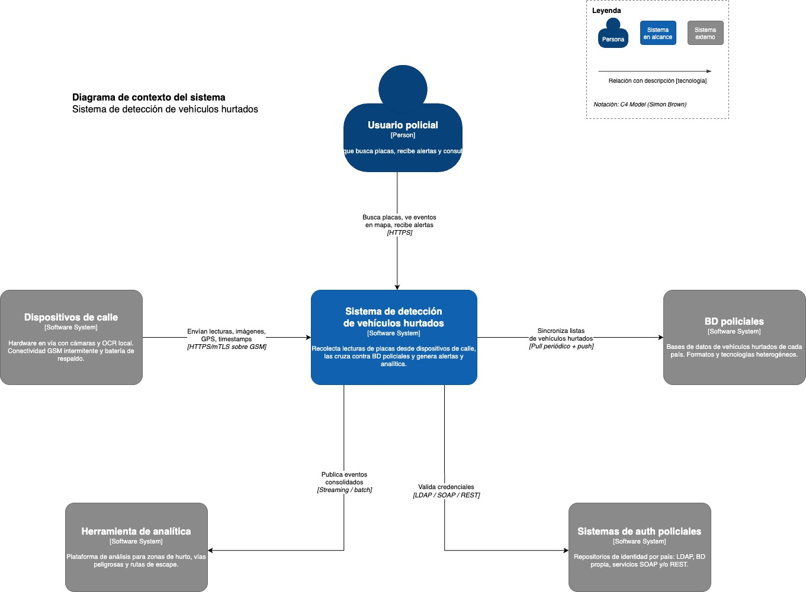
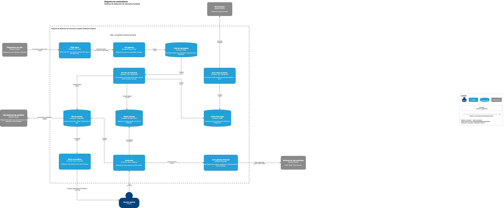
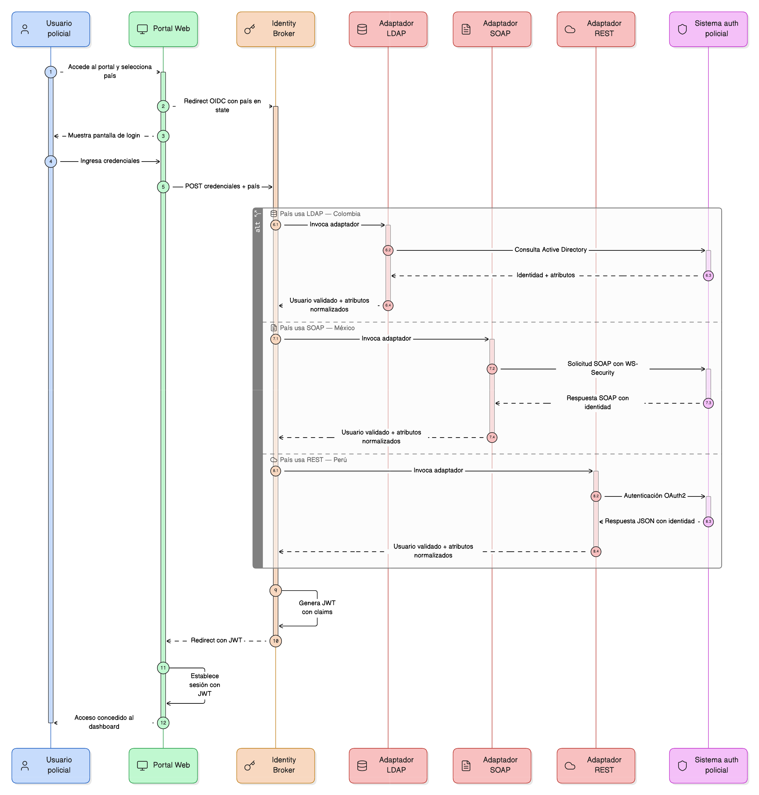
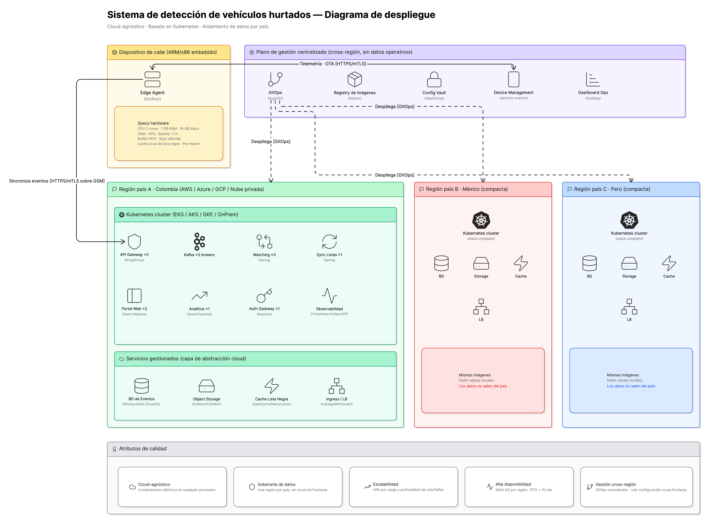
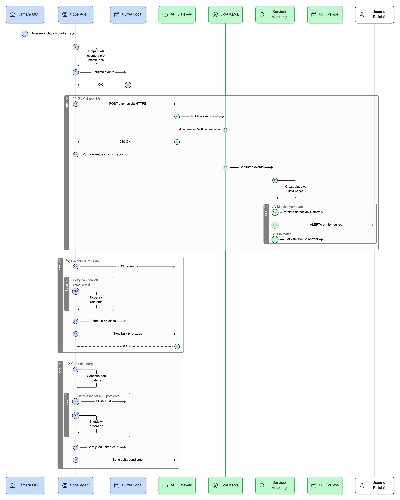

# Propuesta de Arquitectura de Solución
## Sistema para combatir el hurto de vehículos

---

## 1. Resumen de la Propuesta

Ceiba requiere una plataforma que apoye a las entidades policiales de múltiples países a combatir el hurto de vehículos, identificando tendencias y facilitando la recuperación de unidades robadas. La solución debe operar sobre dispositivos de calle con severas restricciones de hardware (2 cores, 1 GB RAM, 16 GB de disco), conectividad GSM intermitente y energía inestable que puede fallar hasta cuatro horas con apenas una hora de batería de respaldo, integrarse con bases de datos policiales heterogéneas por país y con sistemas de autenticación dispares (LDAP, BD propia, SOAP, REST), correr sobre cualquier nube pública o privada, escalar dinámicamente desde Latinoamérica hasta el mundo, garantizar alta disponibilidad y proteger la comunicación contra dispositivos o personas no autorizados.

La solución propuesta resuelve estos requisitos con una arquitectura distribuida que reparte inteligencia entre el dispositivo y la nube. El borde captura, persiste localmente, pre-valida contra la lista de hurtados y sincroniza de forma diferida tolerando fallas de red y energía. El núcleo en la nube ejecuta el matching central, almacena las imágenes, genera las alertas operativas, sirve la búsqueda por matrícula con visualización en mapa y alimenta la analítica de tendencias. El despliegue es containerizado sobre Kubernetes con una capa de abstracción que evita el acoplamiento al proveedor cloud, replicado por país para garantizar la soberanía de datos exigida por la operación multi-país, y gestionado de forma centralizada vía GitOps sin que datos operativos crucen fronteras.

---

## 2. Arquitectura de la Solución

La arquitectura se documenta en cinco diagramas que abordan, en conjunto, todos los requisitos del enunciado. Los dos primeros siguen la notación C4 de Simon Brown y describen el sistema en sus dos primeros niveles (contexto y contenedores). Los tres siguientes son diagramas técnicos complementarios que profundizan en los aspectos que C4 no aborda directamente: el comportamiento dinámico ante fallas, la topología de despliegue y la integración federada de identidad.

### 2.1. Diagrama de contexto del sistema

Este diagrama responde a la pregunta de qué hace el sistema y con quién interactúa. Establece las cinco fronteras de integración que el enunciado menciona explícita o implícitamente: los dispositivos de calle que capturan placas e imágenes pero que tienen autonomía propia y conectividad intermitente, las bases de datos policiales de cada país que proveen el listado de vehículos hurtados con los campos documentados en el enunciado (matrícula, fecha de hurto, lugar, DNI del propietario, marca, clase, línea, color, modelo) y que pueden estar en cualquier formato y tecnología, los sistemas de autenticación heterogéneos de cada institución policial, la herramienta de análisis de datos que el enunciado pide integrar para identificar zonas de hurto, vías peligrosas y rutas de escape, y el usuario policial que es el destinatario final tanto de las alertas operativas como de los análisis de tendencias.

El valor de este diagrama está en que fija los contratos de integración antes de entrar al diseño interno: cada relación lleva descripción y protocolo, lo que permite acotar el alcance del sistema y dejar claro qué responsabilidades quedan dentro y cuáles dependen de terceros (las policías nacionales, los proveedores cloud, los integradores de los dispositivos).

### 2.2. Diagrama de contenedores

Este diagrama abre el sistema y muestra cómo cada requisito funcional del enunciado se materializa en un componente desplegable. La búsqueda por matrícula con visualización en mapa que pide el enunciado vive en el Portal Web. La consolidación de información desde todos los dispositivos vive en la BD de Eventos. El cruce contra la lista de hurtados y la generación de alertas en tiempo casi-real vive en el Servicio de Matching, alimentado por la cache de lista negra que se mantiene fresca mediante el Servicio de Sincronización de Listas que conversa con las BD policiales de cada país. La prueba visual exigida por el enunciado se almacena en Object Storage con hash de integridad. La analítica de tendencias se materializa en el Motor de Analítica. La integración con los sistemas de autenticación policiales se concentra en un único Auth Gateway federado que aísla a los servicios internos de la heterogeneidad de protocolos. La comunicación segura entre dispositivos y sistema, exigida por el enunciado, se implementa en el API Gateway mediante mTLS sobre HTTPS, garantizando que solo dispositivos autorizados con certificado válido puedan enviar eventos.

El componente que merece atención particular es el Edge Agent, alojado en su propio container boundary porque corre dentro del dispositivo y no en la nube. Es la pieza que permite que el sistema cumpla con la garantía de no-pérdida de datos del enunciado: encapsula el buffer FIFO local, la lógica de retry, la cache de la lista negra y el pre-match local. Diseñarlo como un container desplegable independiente, y no como código embebido en el dispositivo, permite actualizar la lógica de captura de forma remota mediante OTA sin tocar el hardware.

### 2.3. Diagrama de secuencia: flujo del dato

Este diagrama resuelve el requisito más exigente del enunciado: garantizar la recolección y sincronización de datos al sistema central a pesar de las fallas de energía y comunicaciones documentadas. El enunciado advierte que la cobertura GSM no siempre está disponible y que la energía puede fallar hasta cuatro horas en lugares donde el dispositivo solo tiene una hora de batería de respaldo. Cualquier arquitectura que dependa de envío inmediato a la nube perdería datos en estos escenarios.

La solución se documenta en tres caminos operativos. En el camino feliz, con GSM y energía disponibles, el dispositivo captura, persiste el evento en el buffer FIFO local en disco, ejecuta un pre-match contra la cache local de la lista negra para marcar la prioridad de sincronización, envía a la nube vía HTTPS sobre mTLS, y solo purga el buffer local cuando el sistema confirma la recepción mediante ACK. Si hay coincidencia con la lista de hurtados, se genera la alerta operativa y se almacena la prueba visual.

En el camino degradado, sin cobertura GSM, el agente sigue capturando placas y acumulándolas en disco. La capacidad de 16 GB del dispositivo permite acumular varias horas de capturas sin desbordamiento. El reintento se ejecuta con backoff exponencial creciente para no agotar la batería en una espera infructuosa. Cuando la cobertura regresa, se sincroniza en bulk priorizando primero los eventos marcados como match local, lo que asegura que las alertas relevantes lleguen al sistema central antes que el flujo regular.

En el camino crítico, con corte de energía, el dispositivo opera con la batería de respaldo durante una hora. Mientras tenga carga sigue capturando y sincronizando con normalidad. Cuando la batería baja del quince por ciento, ejecuta un shutdown ordenado con flush final del buffer al disco y un último intento de sincronización. Cuando la energía retorna, el agente bootea, lee el último ACK confirmado por el sistema y sincroniza solo el delta pendiente, evitando duplicados y garantizando consistencia.

El diseño establece como invariante absoluto que ningún evento capturado se pierde: el buffer FIFO local se persiste antes de cualquier intento de sincronización, y la consistencia entre dispositivo y nube se mantiene mediante reconciliación basada en ACK. Es la garantía operativa que el enunciado exige.

### 2.4. Diagrama de despliegue

Este diagrama resuelve los requisitos no funcionales de infraestructura del enunciado: portabilidad cloud, escalabilidad dinámica, alta disponibilidad y crecimiento desde Latinoamérica hacia el mundo.

La portabilidad cloud se materializa de dos formas. Primero, todos los servicios corren containerizados sobre Kubernetes, que es el sustrato común a EKS, AKS, GKE y a clusters auto-gestionados sobre nube privada. Segundo, una capa de abstracción cloud media el acceso a los servicios de plataforma (almacenamiento de objetos, base de datos, cache, balanceo) ofreciendo interfaces portables que pueden implementarse sobre S3, Azure Blob o GCS, sobre RDS, Azure SQL o Cloud SQL, sobre ElastiCache o Memorystore. Cambiar de proveedor implica reemplazar la implementación de la capa, no reescribir los servicios. Esto responde directamente al requisito del enunciado de evitar el acoplamiento con cualquier nube específica y dejar abierta la opción de nube privada.

La escalabilidad dinámica se logra con HPA (Horizontal Pod Autoscaler) configurado con métricas específicas por componente. El API Gateway escala por carga de ingesta, el matching escala por profundidad de cola Kafka, el portal escala por requests por segundo. Cuando llegan miles de dispositivos sincronizando simultáneamente tras una caída de red, el sistema absorbe el pico sin caer.

La alta disponibilidad se sostiene en múltiples réplicas por servicio (dos para el API Gateway, tres brokers de Kafka, tres instancias de matching, dos del portal) distribuidas en múltiples zonas de disponibilidad por región. La caída de una zona no interrumpe el servicio. El RTO objetivo es menor a quince minutos.

El crecimiento global se resuelve mediante una región independiente por país. Esto cumple un requisito que aunque el enunciado no menciona explícitamente, emerge como necesidad cuando se opera con datos personales (DNI del propietario, placas, ubicaciones) en múltiples jurisdicciones: la soberanía de datos. Una región por país implica que los datos operativos no cruzan fronteras, evitando conflictos con normativas de protección de datos como habeas data en Colombia y equivalentes en otros países. El diagrama muestra una región detallada y dos compactas como réplicas, con la nota explícita de que las imágenes son las mismas y solo los Helm values varían por país.

El plano de gestión centralizado vive cross-región y solo distribuye configuración, manifiestos, imágenes Docker y comandos de control de dispositivos vía GitOps. No almacena datos operativos. Esto permite operar globalmente con un único pipeline de despliegue sin violar las restricciones de soberanía. Las cinco notas al pie del diagrama sintetizan cómo cada atributo de calidad se aborda concretamente.

### 2.5. Diagrama de secuencia: autenticación federada

Este diagrama resuelve el requisito explícito del enunciado de integrarse con los sistemas de autenticación de las distintas instituciones policiales, sabiendo que algunas usan LDAP, otras bases de datos propias, otras servicios SOAP y otras REST. Una integración punto a punto entre cada servicio interno del sistema y cada IdP nacional escalaría con el producto cartesiano de servicios por países, lo que es inviable cuando la visión del enunciado es expandir al resto del mundo.

La solución es el patrón Identity Broker. El portal y los servicios internos solo conocen un protocolo (OIDC y SAML), por lo que no se modifican cuando se agrega un nuevo país. El broker recibe la solicitud de login junto con el país del usuario y enruta a un adaptador específico que encapsula el protocolo de esa policía. El adaptador LDAP ejecuta bind y search contra Active Directory, el adaptador SOAP construye un request con WS-Security, el adaptador REST ejecuta OAuth2 o llama con API key. Cada adaptador devuelve la identidad validada en un formato normalizado, y el broker emite un JWT estándar con claims uniformes (sujeto, país, rol, permisos) que los servicios internos validan localmente sin volver al broker en cada llamada.

El valor de este diseño se ve en dos dimensiones. Primero, agregar un nuevo país equivale a escribir un adaptador nuevo, registrarlo y configurar los Helm values del país; el portal, el broker, el matching, la analítica y los demás componentes no se tocan. Segundo, la federación no se convierte en un cuello de botella porque la validación del JWT es local en cada servicio, lo que se vuelve crítico cuando el sistema crece a miles de usuarios policiales simultáneos.

---

## 3. Componentes Principales

A continuación se describen los componentes que conforman la solución, agrupados por capa lógica, con énfasis en la responsabilidad concreta de cada uno frente a los requisitos del caso.

**Capa edge.** El Edge Agent corre dentro de cada dispositivo de calle. Recibe del componente OCR del dispositivo la matrícula reconocida con su score de confianza, empaqueta el evento con metadata (placa, imagen capturada, coordenadas GPS, timestamp), lo persiste en un buffer FIFO local, ejecuta un pre-match contra una cache local de la lista negra para marcar la prioridad de sincronización, y sincroniza con la nube cuando hay GSM disponible. Es el componente que materializa la garantía de no-pérdida de datos del enunciado.

**Capa de ingesta.** El API Gateway es el punto único de entrada de los eventos hacia la nube. Valida los certificados mTLS y el identificador del dispositivo para impedir que dispositivos no autorizados envíen información, aplica rate limiting para protegerse de inundaciones, y enruta los eventos hacia la cola de mensajería. Esto implementa directamente el requisito de comunicación segura del enunciado. La Cola Kafka desacopla la velocidad de ingesta de la velocidad de procesamiento, garantiza orden de eventos por dispositivo y aporta durabilidad mediante replicación entre brokers, lo que permite absorber picos de sincronización (típicos cuando muchos dispositivos recuperan red simultáneamente) sin perder eventos.

**Capa de procesamiento.** El Servicio de Matching consume los eventos de la cola, cruza cada placa contra la cache de lista negra y, ante una coincidencia, genera la alerta operativa en tiempo casi-real, persiste la detección con su prueba visual y dispara la notificación al usuario policial. Esta es la función central del sistema. El Servicio de Sincronización de Listas mantiene actualizada la cache de lista negra; ejecuta pull periódico contra las BD policiales de cada país y soporta push urgente cuando una policía reporta un hurto reciente, lo que garantiza que un vehículo robado sea detectable rápidamente sin esperar al siguiente ciclo de sincronización.

**Capa de almacenamiento.** La BD de Eventos sobre PostgreSQL almacena las lecturas, detecciones y alertas, particionada por país y por tiempo, lo que mantiene los tiempos de consulta acotados a medida que el volumen crece. Sirve la búsqueda por matrícula que el enunciado pide como funcionalidad principal. El Object Storage almacena las imágenes y pruebas visuales con hash de integridad, lo que sustenta la trazabilidad de la prueba visual exigida por el enunciado. La Cache de Lista Negra sobre Redis mantiene la lista de vehículos hurtados en memoria para que el matching contra el flujo de eventos sea en milisegundos, permitiendo alertar a tiempo para interceptación operativa.

**Capa de presentación.** El Portal Web ofrece la búsqueda por matrícula con visualización en mapa que el enunciado solicita explícitamente, junto con la presentación de eventos, la prueba visual asociada, las alertas activas y los reportes operativos. El Motor de Analítica sobre Spark y Superset procesa los eventos consolidados y presenta tendencias, heat maps de zonas de hurto, vías peligrosas y rutas de escape recurrentes; cubre el requisito del enunciado de integrar una herramienta de análisis de datos para identificar tendencias.

**Capa transversal.** El Auth Gateway federado, sobre Keycloak, materializa el patrón Identity Broker que aísla a los servicios internos de la heterogeneidad de los sistemas de autenticación policiales. Expone OIDC y SAML hacia adentro y traduce hacia LDAP, SOAP o REST según el adaptador del país.

**Plano de gestión centralizado.** Vive fuera de las regiones operativas y no almacena datos del negocio. Lo componen ArgoCD para despliegue declarativo vía GitOps, un registry central de imágenes Docker, un Vault de configuración con secrets y Helm values por país, un servicio de Device Management para registro de dispositivos, monitoreo de salud y distribución OTA de listas negras y firmware, y un dashboard de operaciones cross-país. Permite operar el sistema globalmente desde un solo plano de control sin que datos operativos crucen fronteras.

---

## 4. Decisiones de Diseño

**Procesamiento en el borde con sincronización diferida.** El requisito de no-pérdida de datos ante cortes de GSM y energía, dadas las restricciones documentadas en el enunciado (cobertura intermitente, una hora de batería frente a cortes de hasta cuatro horas), hace inviable depender exclusivamente del procesamiento central. La decisión es darle inteligencia local al dispositivo: buffer FIFO persistente como invariante absoluto, pre-match local contra una cache cacheada de la lista negra, retry con backoff exponencial para no agotar batería, y shutdown ordenado con flush final cuando la batería baja del quince por ciento. Como alternativa se evaluó el envío inmediato sin buffer local; se descartó porque garantiza pérdida de datos en los escenarios que el enunciado documenta como recurrentes.

**Cloud-agnóstico mediante Kubernetes y capa de abstracción.** El enunciado pide explícitamente evitar el acoplamiento al proveedor cloud y dejar abierta la opción de nube privada. La decisión es containerizar todos los servicios sobre Kubernetes y mediar el acceso a servicios de plataforma a través de una capa de abstracción con interfaces portables. Cambiar de proveedor implica reemplazar la implementación de la capa, no reescribir servicios. Como alternativa se consideró usar servicios serverless propios de cada proveedor; se descartó porque genera el acoplamiento que el enunciado pide evitar y porque limita la portabilidad hacia nube privada.

**Aislamiento de datos por país con plano de gestión centralizado.** El enunciado contempla operación multi-país con expansión global y maneja datos personales (DNI del propietario, placas, ubicaciones). Esto obliga a contemplar soberanía de datos aunque el enunciado no la mencione explícitamente: una región independiente por país, con su propio cluster Kubernetes y su propio almacenamiento, donde los datos operativos no cruzan fronteras. El plano de gestión centralizado vive separado y solo distribuye configuración y manifiestos vía GitOps. Como alternativa se evaluó un único cluster multi-región; se descartó porque concentrar datos de varios países en una sola jurisdicción introduce riesgo regulatorio y porque dificulta operar bajo nube privada cuando algún gobierno lo exija.

**Patrón Identity Broker para autenticación federada.** El enunciado documenta que las policías usan LDAP, bases de datos propias, SOAP y REST. La decisión es exponer un único auth gateway que habla OIDC y SAML hacia adentro y traduce a los protocolos de cada policía mediante adaptadores plug-in. El gateway emite un JWT estándar con claims normalizados que los servicios internos validan localmente. Agregar un nuevo país equivale a escribir un adaptador nuevo, sin tocar el resto del sistema. Como alternativa se evaluó integrar cada servicio interno directamente con cada IdP nacional; se descartó porque escala con el producto cartesiano de servicios por países, inviable cuando la visión es expandir al mundo.

**Ingesta asíncrona con cola de mensajería.** La velocidad de llegada de eventos es impredecible: depende del tráfico de cada vía, del número de dispositivos activos y de los picos que ocurren cuando muchos dispositivos recuperan conectividad simultáneamente tras una caída. La decisión es desacoplar ingesta y procesamiento mediante Kafka. El API Gateway encola, los servicios consumen al ritmo que pueden, el HPA escala el matching por profundidad de la cola. Como alternativa se evaluó matching síncrono dentro del flujo de ingesta; se descartó porque convierte cualquier degradación del matching en degradación de la ingesta y, por extensión, en pérdida de datos en el edge.

**Pre-match local para alertas inmediatas.** La latencia entre el paso del vehículo y la alerta determina la capacidad real de interceptación. Llevar cada placa a la nube y esperar respuesta del matching introduce latencia que el enlace GSM intermitente puede prolongar a segundos o minutos. La decisión es ejecutar un pre-match en el dispositivo contra la cache local de la lista negra, lo que permite marcar el evento como prioridad alta para sincronización y, en una segunda iteración, disparar una alerta local incluso sin red. La cache se mantiene actualizada vía OTA desde el plano de gestión centralizado.

**Comunicación segura mediante mTLS por dispositivo.** El enunciado exige que solo dispositivos autorizados puedan enviar información al sistema. La decisión es emitir un certificado por dispositivo durante el provisioning y validar tanto el certificado como el identificador del dispositivo en el API Gateway. Esto previene que un atacante con acceso físico a un dispositivo pueda inyectar lecturas falsas usando otro hardware, y permite revocar dispositivos comprometidos sin afectar al resto. Como alternativa se consideró usar API keys compartidas; se descartó porque una clave filtrada compromete a todos los dispositivos.

---

## 5. Consideraciones de Calidad

**Disponibilidad.** Cada región opera de forma independiente sobre Kubernetes con réplicas múltiples por servicio. El despliegue es multi-AZ dentro de cada proveedor cloud, lo que tolera la caída de una zona sin interrupción de servicio. El RTO objetivo es menor a quince minutos. La caída de una región no afecta a las demás dada la arquitectura de aislamiento por país.

**Escalabilidad.** Todos los servicios escalan horizontalmente vía HPA con métricas específicas: el API Gateway por carga de ingesta, el matching por profundidad de la cola Kafka, el portal por requests por segundo. Kafka escala añadiendo brokers y particiones. La arquitectura permite agregar nuevas regiones (nuevos países) sin modificar el sistema, solo desplegando un nuevo cluster con sus Helm values específicos. Esto cumple la visión del enunciado de iniciar en Latinoamérica y expandir al mundo.

**Seguridad.** La comunicación entre dispositivos y sistema usa mTLS sobre HTTPS, con certificado por dispositivo emitido en el provisioning. Solo dispositivos autorizados pueden enviar eventos. Las imágenes se almacenan con hash de integridad para garantizar trazabilidad. Los servicios internos se autentican entre sí mediante mTLS dentro del cluster. Los secrets se gestionan vía HashiCorp Vault y se inyectan en los pods al despliegue. La autenticación de usuarios se federa con los IdP de cada policía sin que el sistema almacene credenciales.

**Rendimiento.** El matching se ejecuta en milisegundos gracias a la cache Redis de la lista negra, lo que permite generar alertas en tiempo casi-real para apoyar la interceptación operativa. La cola Kafka absorbe picos de ingesta sin contrapresión hacia los dispositivos. El particionamiento de la BD de eventos por país y por tiempo mantiene los tiempos de consulta acotados a medida que el volumen crece. El pre-match local en el dispositivo elimina la dependencia de la latencia GSM para la priorización de eventos críticos.

**Portabilidad cloud.** Toda la lógica de negocio corre containerizada sobre Kubernetes, agnóstica al proveedor. La capa de abstracción cloud aísla la aplicación de los servicios gestionados específicos. El cambio de proveedor implica reemplazar la implementación de esta capa, no reescribir servicios. Esto cumple el requisito del enunciado de evitar el acoplamiento con AWS, Azure o GCP, y deja abierta la opción de operar sobre nube privada cuando algún gobierno lo exija.

**Tolerancia a fallas.** El edge agent con buffer FIFO local persistente garantiza la no-pérdida de datos ante cortes de GSM y energía. El backoff exponencial protege la batería durante reconexiones. El shutdown ordenado al quince por ciento de batería preserva el buffer y ejecuta el sync final. Al boot, la reconciliación contra el último ACK del servidor evita duplicados y completa el delta pendiente.

**Soberanía de datos.** Una región por país, datos operativos no cruzan fronteras. El plano de gestión centralizado solo distribuye configuración y manifiestos, nunca datos del negocio. Cada región puede operar sobre el proveedor cloud que cada gobierno requiera, incluyendo nube privada cuando la regulación lo exija.

**Observabilidad.** Cada región tiene su stack completo de observabilidad sobre componentes open source y portables: Prometheus para métricas, Grafana para visualización, OpenTelemetry para trazas distribuidas, AlertManager para alertas operativas y EFK stack para logs. El dashboard del plano de gestión centralizado agrega métricas de salud de todas las regiones sin exponer datos operativos.

---

## 6. Supuestos

La propuesta se desarrolló sobre los siguientes supuestos, que en un caso real se validarían con la Gerencia de Tecnología de Ceiba antes del diseño final.

**Volumetría.** Piloto de quinientos dispositivos en dos ciudades de un país, con horizonte de diez mil dispositivos en cinco países de Latinoamérica a tres años. Cada dispositivo lee entre una y cinco placas por segundo en hora pico de tráfico denso.

**Latencia operativa.** El sistema requiere alertas en tiempo casi-real (segundos) para habilitar interceptación en vía, además de la consolidación posterior para análisis de tendencias. La latencia objetivo entre detección y alerta es menor a cinco segundos en condiciones normales de red.

**Soberanía de datos.** Las imágenes y eventos no pueden salir del país de origen. Cada país tiene normativa de protección de datos personales (habeas data en Colombia y equivalentes) que el sistema debe cumplir. Una región independiente por país.

**Cadena de custodia.** La imagen capturada se considera insumo de inteligencia policial, no evidencia judicial formal. La cadena de custodia es responsabilidad de la policía una vez exporta los datos. El sistema garantiza integridad mediante hash y trazabilidad de acceso, pero no certificación forense.

**Retención.** Las capturas de vehículos no hurtados se retienen durante treinta días y se purgan automáticamente. Las capturas asociadas a vehículos hurtados se retienen indefinidamente hasta el cierre del caso por parte de la policía.

**Integración con BD policiales.** Pull periódico cada seis horas con capacidad de recibir push para actualizaciones urgentes (robo recién reportado). Se sincroniza un delta, no la lista completa cada vez. El formato de cada país varía, por lo que se desarrolla un adaptador específico por país.

**OCR del dispositivo.** Precisión del noventa y cinco por ciento, falsos positivos del tres por ciento, score de confianza incluido en cada lectura. Lecturas con confianza por debajo del ochenta por ciento se sincronizan con la imagen completa para reprocesamiento central.

**Gestión de dispositivos.** La operación física en campo (instalación, reemplazo, suministro eléctrico) la opera un tercero. El sistema sí contempla la gestión lógica: registro, monitoreo de salud, distribución OTA de listas negras y firmware, configuración remota.

**Frecuencia de captura y tamaño de imagen.** Promedio de tres lecturas por segundo en hora pico, con picos de hasta cinco. Tamaño promedio de imagen comprimida de doscientos kilobytes. El ancho de banda GSM disponible se asume como peor caso (2G/EDGE intermitente).

**Modelo de identidad.** El sistema expone OIDC y SAML hacia los servicios internos. Cada policía nacional se integra mediante un adaptador específico (LDAP, SOAP o REST según corresponda). Las credenciales de los policías nunca se almacenan en el sistema; solo se valida contra el IdP del país.

**Proveedor cloud objetivo del primer despliegue.** Para efectos de dimensionamiento de costos y dependencias se asume un proveedor concreto por región, manteniendo el diseño portable mediante la capa de abstracción cloud y la containerización sobre Kubernetes.
